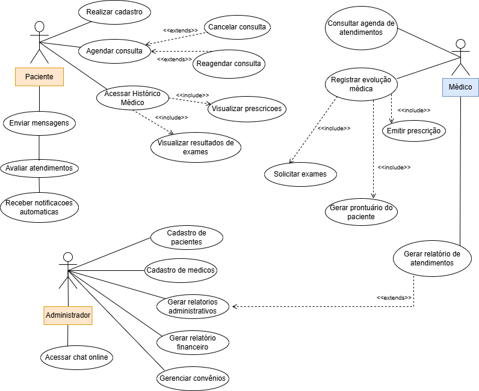
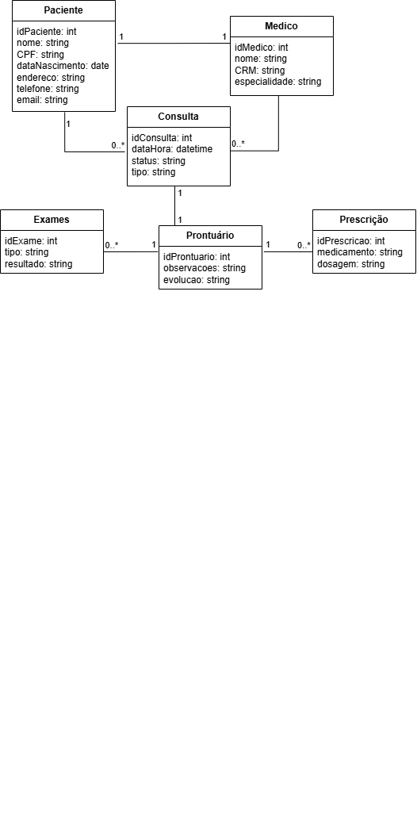

# 📊 Diagramas do Sistema Clínica Médica Vitalis

## 🧩 Diagrama de Caso de Uso

**Figura 1 – Diagrama de Caso de Uso**

O diagrama de caso de uso representa as interações entre os três perfis principais do sistema:  
**Administrador**, **Médico** e **Paciente**, descrevendo como cada ator utiliza as funcionalidades de acordo com suas responsabilidades.

### ✨ Definição (o que é um Caso de Uso?)

Um **caso de uso** descreve uma funcionalidade do sistema do ponto de vista do usuário, representando um fluxo de ações que um ator realiza para atingir um objetivo específico.  
Esses casos permitem visualizar **o que o sistema deve fazer**, sem detalhar a implementação técnica.

### 👥 Atores do Sistema

- **Administrador** – Gerencia cadastros, acessos, relatórios e configurações gerais da clínica.  
- **Médico** – Registra atendimentos, visualiza agenda, emite laudos e prescrições.  
- **Paciente** – Agenda consultas, acessa exames, prontuário e recebe notificações.

### 🔍 Descrição dos Casos de Uso (2 casos completos)

---

## ✔️ Caso de Uso 1 — Agendar Consulta (Paciente)

**Ator Principal:** Paciente  
**Descrição:** Permite que o paciente selecione um médico, escolha uma data e horário disponíveis e confirme o agendamento.  
**Pré-condições:**  
- O paciente deve estar autenticado no sistema.  
- Deve existir ao menos um médico com horários cadastrados.

**Fluxo Principal:**  
1. O paciente acessa o menu **Agendamento**.  
2. O sistema exibe a lista de especialidades e médicos disponíveis.  
3. O paciente seleciona um médico.  
4. O sistema exibe datas e horários livres.  
5. O paciente escolhe um horário.  
6. O sistema confirma o agendamento e gera uma notificação.  
7. O agendamento é salvo no histórico do paciente.

**Fluxos Alternativos:**  
- 4A. Caso o médico não tenha horários disponíveis, o sistema exibe mensagem de indisponibilidade.  
- 6A. Caso o paciente desista, o sistema cancela o processo.

**Pós-condições:**  
- Consulta registrada e disponível para visualização na área do paciente.

---

## ✔️ Caso de Uso 2 — Registrar Evolução Médica (Médico)

**Ator Principal:** Médico  
**Descrição:** O médico acessa uma consulta já realizada e registra informações clínicas referentes ao atendimento do paciente.

**Pré-condições:**  
- O médico deve estar logado.  
- Deve existir uma consulta vinculada ao paciente na data atual.

**Fluxo Principal:**  
1. O médico acessa o menu **Consultas do Dia**.  
2. O sistema lista os pacientes agendados.  
3. O médico seleciona o paciente atendido.  
4. O sistema exibe o formulário de evolução médica.  
5. O médico insere diagnóstico, observações e anexos (opcional).  
6. O sistema salva o prontuário atualizado.

**Fluxos Alternativos:**  
- 5A. Caso haja falha no envio de anexos, o sistema salva apenas o texto.  
- 3A. Caso a consulta não esteja vinculada ao médico, o sistema bloqueia o acesso.

**Pós-condições:**  
- Evolução gravada e integrada ao prontuário do paciente.

---

## 🧱 Diagrama de Classes

**Figura 2 – Diagrama de Classes**

O diagrama de classes representa a estrutura lógica do sistema e os relacionamentos entre as entidades principais:  
**Paciente**, **Médico**, **Consulta**, **Prontuário**, **Exame** e **Prescrição**.

### Principais Relações

- A classe **Paciente** possui associação *1 para 0..*** com **Consulta**, pois um paciente pode ter várias consultas.  
- Cada **Consulta** é realizada por um **Médico** e gera exatamente um **Prontuário**.  
- O **Prontuário** pode conter vários **Exames** e várias **Prescrições**, compondo o histórico médico completo.

---

> 💡 *Todos os diagramas e descrições seguem o modelo UML e foram baseados no minimundo proposto para a Clínica Médica Vitalis.*

