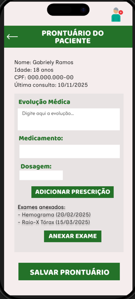

# Protótipos de Telas

Os protótipos foram desenvolvidos no Figma e representam a navegação principal do sistema para pacientes, médicos e administradores.

##  Tela de Login

##  Painel do Paciente

##  Agendamento de Exames

##  Prontuário do Paciente

##  Relatório de Exames

## Relatório de Avaliacao 

